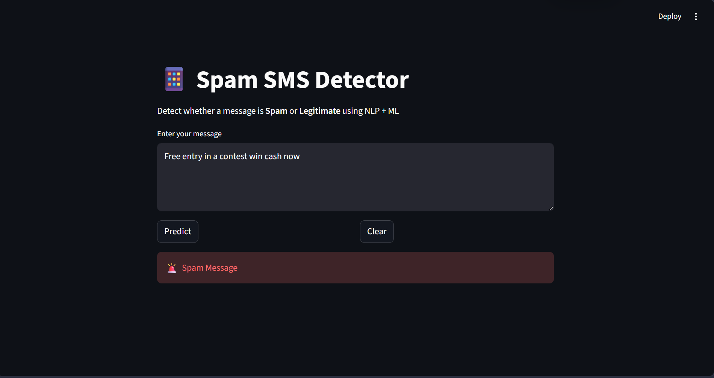
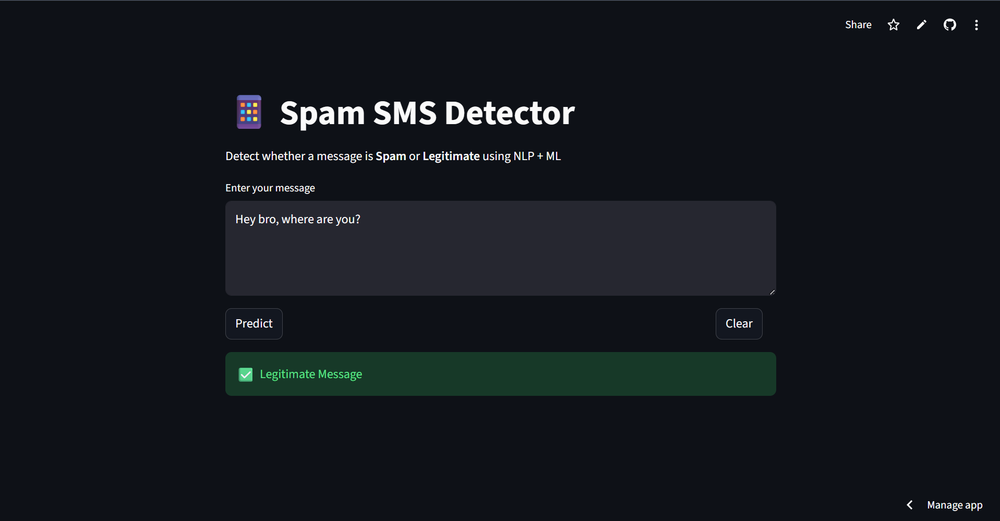
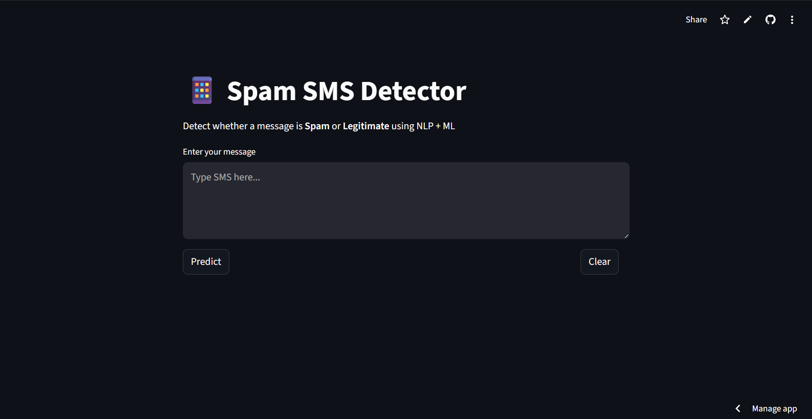

# 📱 Spam SMS Detector

A Machine Learning web application that classifies SMS messages as **Spam** or **Legitimate** using Natural Language Processing (NLP).

---

## 🚀 Features

* Text preprocessing using NLTK (stopwords + stemming)
* TF-IDF vectorization (unigrams & bigrams)
* Model comparison:

  * Naive Bayes
  * Logistic Regression
  * Support Vector Machine (SVM)
* Streamlit-based interactive UI
* Real-time SMS classification

---

## 🧠 Models Used

* Naive Bayes
* Logistic Regression
* Support Vector Machine (SVM)

> After comparison, **SVM achieved the best performance (~98% accuracy)** and was selected as the final model.

---

## 📊 Results

* Accuracy: ~98%
* High precision and recall
* Confusion matrix used for evaluation

---

## 🖼️ Screenshots

### 🚨 Spam Detection



### ✅ Legitimate Message



### 💻 User Interface



---

## ⚙️ Installation

```bash
pip install -r requirements.txt
```

---

## ▶️ Run the Project

```bash
python src/train.py
streamlit run app.py
```

---

## 📁 Project Structure

```text
spam-sms-detector/
│
├── app.py
├── requirements.txt
├── README.md
├── LICENSE
├── .gitignore
├── assets/
├── model/
├── src/
└── data/
```

---

## 📌 Tech Stack

* Python
* Scikit-learn
* NLTK
* Streamlit
* Matplotlib & Seaborn

---

## 💼 Use Case

* Detect spam messages in real-time
* Demonstrates end-to-end ML pipeline
* Useful for learning NLP + deployment

---

## 📄 License

This project is licensed under the MIT License.

---

## 👤 Author

**Susovan Hati**
GitHub: https://github.com/SusovanGit10
